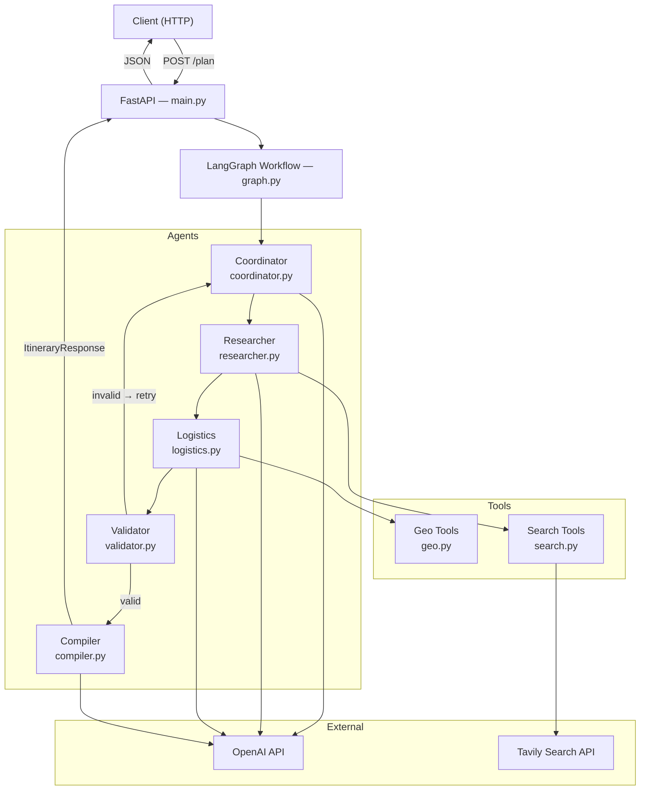
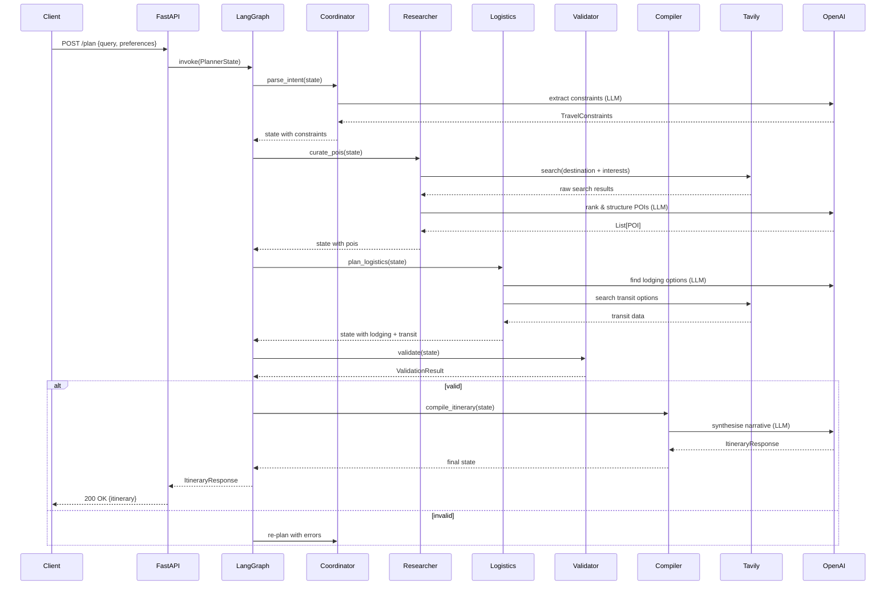
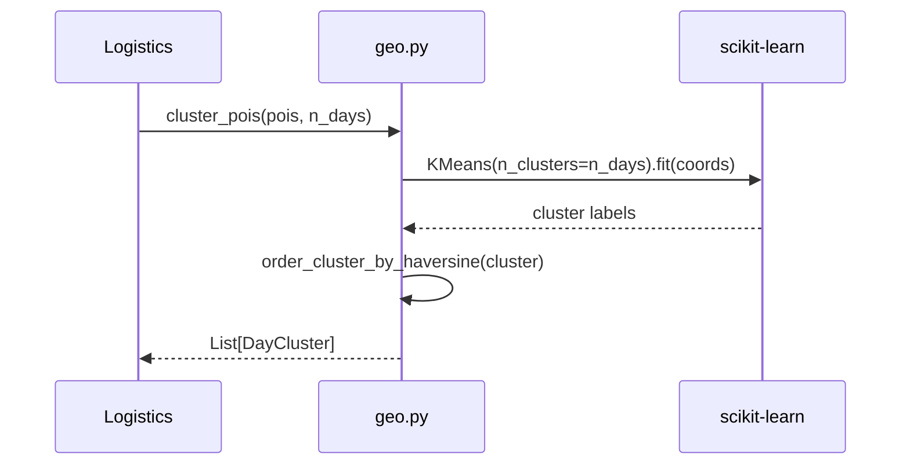

# Design Document: Travel Planner Application

## Overview

The Travel Planner is a multi-agent AI system that takes a natural-language travel request and produces
a structured, day-by-day itinerary. It is built on top of FastAPI and LangGraph, using a directed
agent graph where each node is a specialised agent (coordinator, researcher, logistics, validator,
compiler). External knowledge is sourced in real-time through Tavily search, while geographic
clustering via K-Means and Haversine distance is applied locally to optimise tour routing.

The design spans two layers: a **high-level** architectural view (components, data models, sequence
flows) and a **low-level** implementation view (algorithm pseudocode, function signatures, formal
specifications).

---

## Architecture



---

## Sequence Diagrams

### Main Happy-Path Flow



### Geo-Clustering Sub-Flow



---

## Components and Interfaces

### 1. FastAPI Entry Point — `app/main.py`

**Purpose**: HTTP boundary; validates request/response shapes, starts the LangGraph workflow.

**Interface**:
```python
@app.post("/plan", response_model=ItineraryResponse)
async def plan_trip(request: TravelRequest) -> ItineraryResponse: ...

@app.get("/health")
async def health_check() -> dict: ...
```

**Responsibilities**:
- Parse and validate incoming `TravelRequest` via Pydantic
- Initialise `PlannerState` and invoke the LangGraph workflow
- Return `ItineraryResponse` or a structured error

---

### 2. Coordinator Agent — `app/agents/coordinator.py`

**Purpose**: First node in the graph; converts free-text travel intent into structured constraints.

**Interface**:
```python
def parse_intent(state: PlannerState) -> PlannerState: ...
def extract_constraints(query: str, llm: ChatOpenAI) -> TravelConstraints: ...
```

**Responsibilities**:
- Call OpenAI to extract destination, duration, budget, traveller count, interests
- Populate `state.constraints`
- Set `state.status = "researching"`

---

### 3. Researcher Agent — `app/agents/researcher.py`

**Purpose**: Discovers and ranks Points of Interest (POIs) and activities.

**Interface**:
```python
def curate_pois(state: PlannerState) -> PlannerState: ...
def search_pois(constraints: TravelConstraints, search: TavilySearch) -> list[dict]: ...
def rank_pois(raw: list[dict], constraints: TravelConstraints, llm: ChatOpenAI) -> list[POI]: ...
```

**Responsibilities**:
- Execute Tavily searches for POIs, attractions, and activities
- Use OpenAI to rank and deduplicate results
- Populate `state.pois`

---

### 4. Logistics Agent — `app/agents/logistics.py`

**Purpose**: Plans lodging, transit, and geo-optimised daily tour routes.

**Interface**:
```python
def plan_logistics(state: PlannerState) -> PlannerState: ...
def find_lodging(constraints: TravelConstraints, llm: ChatOpenAI) -> list[LodgingOption]: ...
def find_transit(constraints: TravelConstraints, search: TavilySearch) -> list[TransitOption]: ...
def assign_days(pois: list[POI], n_days: int) -> list[DayCluster]: ...
```

**Responsibilities**:
- Search for lodging options via OpenAI + Tavily
- Search transit options (flights, trains, local transport)
- Cluster POIs by geography into per-day groups using `geo.cluster_pois`

---

### 5. Validator Agent — `app/agents/validator.py`

**Purpose**: Deterministic gate that checks business-rule correctness before final compilation.

**Interface**:
```python
def validate(state: PlannerState) -> PlannerState: ...
def check_budget(itinerary: PartialItinerary, budget: BudgetLevel) -> ValidationError | None: ...
def check_day_capacity(clusters: list[DayCluster]) -> ValidationError | None: ...
def check_opening_hours(pois: list[POI]) -> list[ValidationError]: ...
```

**Responsibilities**:
- Enforce max POIs per day (configurable, default 5)
- Flag budget overruns based on lodging + activity tier
- Accumulate `state.validation_errors`; set `state.status` to `"valid"` or `"invalid"`

---

### 6. Compiler Agent — `app/agents/compiler.py`

**Purpose**: Final node; synthesises all structured data into a human-readable itinerary.

**Interface**:
```python
def compile_itinerary(state: PlannerState) -> PlannerState: ...
def build_prompt(state: PlannerState) -> str: ...
def parse_llm_output(raw: str) -> ItineraryResponse: ...
```

**Responsibilities**:
- Build a rich prompt from constraints, POIs, lodging, transit, and day clusters
- Call OpenAI to produce a narrative itinerary
- Parse the LLM response into `ItineraryResponse`

---

### 7. Geo Tools — `app/tools/geo.py`

**Purpose**: Location maths — Haversine distance and K-Means clustering for route optimisation.

**Interface**:
```python
def haversine(lat1: float, lon1: float, lat2: float, lon2: float) -> float: ...
def cluster_pois(pois: list[POI], n_clusters: int) -> list[DayCluster]: ...
def order_cluster_by_haversine(cluster: list[POI]) -> list[POI]: ...
def nearest_neighbour_route(pois: list[POI]) -> list[POI]: ...
```

---

### 8. Search Tools — `app/tools/search.py`

**Purpose**: Wraps Tavily API with retry, caching, and result normalisation.

**Interface**:
```python
def search(query: str, max_results: int = 5) -> list[SearchResult]: ...
def batch_search(queries: list[str]) -> list[list[SearchResult]]: ...
```

---

### 9. LangGraph Workflow — `app/workflow/graph.py`

**Purpose**: Assembles the agent nodes into a compiled, checkpointed state machine.

**Interface**:
```python
def build_graph() -> CompiledGraph: ...
def should_replan(state: PlannerState) -> str: ...  # conditional edge
```

---

## Data Models

### `TravelRequest` (API input)

```python
class TravelRequest(BaseModel):
    query: str                          # free-text, e.g. "5 days in Kyoto for 2"
    preferences: list[str] = []        # ["temples", "food", "hiking"]
    budget: BudgetLevel = BudgetLevel.MEDIUM
    start_date: date | None = None
    end_date: date | None = None
```

**Validation Rules**:
- `query` must be non-empty, max 500 characters
- `preferences` max 10 items
- `start_date` must be today or future; `end_date` > `start_date`

---

### `TravelConstraints` (extracted by Coordinator)

```python
class TravelConstraints(BaseModel):
    destination: str
    n_days: int                         # 1–30
    budget: BudgetLevel                 # LOW | MEDIUM | HIGH | LUXURY
    traveller_count: int = 1
    interests: list[str] = []
    start_date: date | None = None
```

---

### `POI` (Point of Interest)

```python
class POI(BaseModel):
    name: str
    category: str                       # "museum" | "restaurant" | "park" | ...
    description: str
    lat: float
    lon: float
    rating: float | None = None        # 0.0 – 5.0
    estimated_duration_hours: float = 1.0
    price_tier: int = 1                # 1 (free) – 4 (luxury)
    opening_hours: str | None = None
```

---

### `DayCluster`

```python
class DayCluster(BaseModel):
    day_number: int
    pois: list[POI]
    centroid_lat: float
    centroid_lon: float
    total_duration_hours: float
```

---

### `LodgingOption`

```python
class LodgingOption(BaseModel):
    name: str
    type: str                           # "hotel" | "hostel" | "airbnb" | ...
    price_per_night: float | None = None
    price_tier: int                    # 1–4
    lat: float
    lon: float
    check_in: date | None = None
    check_out: date | None = None
```

---

### `TransitOption`

```python
class TransitOption(BaseModel):
    mode: str                           # "flight" | "train" | "bus" | "car"
    origin: str
    destination: str
    departure_time: datetime | None = None
    arrival_time: datetime | None = None
    price_estimate: float | None = None
```

---

### `PlannerState` (LangGraph state schema)

```python
class PlannerState(TypedDict):
    query: str
    preferences: list[str]
    constraints: TravelConstraints | None
    pois: list[POI]
    day_clusters: list[DayCluster]
    lodging: list[LodgingOption]
    transit: list[TransitOption]
    validation_errors: list[str]
    status: Literal["init", "researching", "logistics", "validating", "compiling", "done", "error"]
    itinerary: ItineraryResponse | None
    retry_count: int
```

---

### `ItineraryResponse` (API output)

```python
class ItineraryResponse(BaseModel):
    destination: str
    n_days: int
    days: list[DayPlan]
    lodging: list[LodgingOption]
    transit: list[TransitOption]
    total_estimated_cost: float | None = None
    tips: list[str] = []
    generated_at: datetime
```

---

### `DayPlan`

```python
class DayPlan(BaseModel):
    day_number: int
    date: date | None = None
    theme: str
    pois: list[POI]
    narrative: str
    estimated_walking_km: float
```

---

### `BudgetLevel` (enum)

```python
class BudgetLevel(str, Enum):
    LOW     = "low"        # price_tier 1
    MEDIUM  = "medium"     # price_tier 1–2
    HIGH    = "high"       # price_tier 1–3
    LUXURY  = "luxury"     # price_tier 1–4
```

---

## Algorithmic Pseudocode

### Main Workflow — `graph.py`

```pascal
PROCEDURE build_graph()
  OUTPUT: CompiledGraph

  SEQUENCE
    graph ← StateGraph(PlannerState)

    graph.add_node("coordinator", parse_intent)
    graph.add_node("researcher",  curate_pois)
    graph.add_node("logistics",   plan_logistics)
    graph.add_node("validator",   validate)
    graph.add_node("compiler",    compile_itinerary)

    graph.set_entry_point("coordinator")
    graph.add_edge("coordinator", "researcher")
    graph.add_edge("researcher",  "logistics")
    graph.add_edge("logistics",   "validator")

    // Conditional edge: retry up to MAX_RETRIES times
    graph.add_conditional_edges(
      "validator",
      should_replan,
      { "replan": "coordinator", "compile": "compiler" }
    )

    graph.set_finish_point("compiler")

    checkpointer ← MemorySaver()
    RETURN graph.compile(checkpointer)
  END SEQUENCE
END PROCEDURE

PROCEDURE should_replan(state)
  INPUT: state of type PlannerState
  OUTPUT: "replan" | "compile"

  SEQUENCE
    IF state.status = "invalid" AND state.retry_count < MAX_RETRIES THEN
      RETURN "replan"
    ELSE
      RETURN "compile"
    END IF
  END SEQUENCE
END PROCEDURE
```

**Preconditions:**
- All five agent functions are importable and callable
- `MemorySaver` checkpointer is available

**Postconditions:**
- Returns a compiled, executable `CompiledGraph`
- Conditional edge routes to `"replan"` at most `MAX_RETRIES` times

---

### Coordinator — `extract_constraints`

```pascal
PROCEDURE extract_constraints(query, llm)
  INPUT:  query of type String, llm of type ChatOpenAI
  OUTPUT: constraints of type TravelConstraints

  SEQUENCE
    system_prompt ← build_extraction_prompt()
    messages ← [SystemMessage(system_prompt), HumanMessage(query)]
    response ← llm.invoke(messages)
    raw_json  ← parse_json(response.content)
    constraints ← TravelConstraints(**raw_json)
    RETURN constraints
  END SEQUENCE
END PROCEDURE
```

**Preconditions:**
- `query` is non-empty
- `llm` is a configured `ChatOpenAI` instance

**Postconditions:**
- Returns a valid `TravelConstraints` with at minimum `destination` and `n_days`
- Raises `ConstraintExtractionError` if LLM output cannot be parsed

---

### Researcher — `rank_pois`

```pascal
PROCEDURE rank_pois(raw_results, constraints, llm)
  INPUT:  raw_results List[dict], constraints TravelConstraints, llm ChatOpenAI
  OUTPUT: ranked_pois List[POI]

  SEQUENCE
    deduplicated ← deduplicate_by_name(raw_results)
    prompt ← build_ranking_prompt(deduplicated, constraints)
    response ← llm.invoke(prompt)
    ranked_pois ← []

    FOR each item IN parse_json_list(response.content) DO
      poi ← POI(**item)
      ranked_pois.append(poi)
    END FOR

    RETURN ranked_pois[0 .. MAX_POIS_TOTAL]
  END SEQUENCE
END PROCEDURE
```

**Preconditions:**
- `raw_results` is non-empty
- Each dict in `raw_results` has at minimum `name`, `lat`, `lon`

**Postconditions:**
- Returns at most `MAX_POIS_TOTAL` (default 30) `POI` objects
- All returned POIs have valid lat/lon coordinates

---

### Geo Tools — `cluster_pois`

```pascal
PROCEDURE cluster_pois(pois, n_clusters)
  INPUT:  pois List[POI], n_clusters Integer
  OUTPUT: clusters List[DayCluster]

  PRECONDITION: len(pois) >= n_clusters
  PRECONDITION: n_clusters >= 1

  SEQUENCE
    coords ← [[p.lat, p.lon] FOR p IN pois]
    model  ← KMeans(n_clusters=n_clusters, random_state=42)
    labels ← model.fit_predict(coords)

    cluster_map ← defaultdict(list)
    FOR i IN range(len(pois)) DO
      cluster_map[labels[i]].append(pois[i])
    END FOR

    result ← []
    FOR day_num, cluster_pois IN enumerate(cluster_map.values()) DO
      ordered ← order_cluster_by_haversine(cluster_pois)
      centroid ← compute_centroid(cluster_pois)
      total_hours ← sum(p.estimated_duration_hours FOR p IN ordered)

      result.append(DayCluster(
        day_number=day_num + 1,
        pois=ordered,
        centroid_lat=centroid.lat,
        centroid_lon=centroid.lon,
        total_duration_hours=total_hours
      ))
    END FOR

    RETURN result
  END SEQUENCE
END PROCEDURE
```

**Preconditions:**
- `len(pois) >= n_clusters >= 1`
- All POIs have valid float `lat` and `lon`

**Postconditions:**
- Returns exactly `n_clusters` `DayCluster` objects
- Each POI appears in exactly one cluster
- POIs within each cluster are ordered by nearest-neighbour Haversine route

**Loop Invariants:**
- `cluster_map` grows monotonically; each POI assigned exactly once

---

### Geo Tools — `haversine`

```pascal
PROCEDURE haversine(lat1, lon1, lat2, lon2)
  INPUT:  lat1, lon1, lat2, lon2 of type Float (degrees)
  OUTPUT: distance of type Float (kilometres)

  SEQUENCE
    R    ← 6371.0                       // Earth radius in km
    dlat ← radians(lat2 - lat1)
    dlon ← radians(lon2 - lon1)
    a    ← sin(dlat/2)^2 + cos(radians(lat1)) * cos(radians(lat2)) * sin(dlon/2)^2
    c    ← 2 * atan2(sqrt(a), sqrt(1 - a))
    RETURN R * c
  END SEQUENCE
END PROCEDURE
```

**Preconditions:**
- `-90 ≤ lat1, lat2 ≤ 90`
- `-180 ≤ lon1, lon2 ≤ 180`

**Postconditions:**
- Returns non-negative float in kilometres
- `haversine(x, y, x, y) = 0.0` for any valid `x, y`

---

### Geo Tools — `nearest_neighbour_route`

```pascal
PROCEDURE nearest_neighbour_route(pois)
  INPUT:  pois List[POI]
  OUTPUT: ordered List[POI]

  PRECONDITION: len(pois) >= 1

  SEQUENCE
    unvisited ← copy(pois)
    ordered   ← [unvisited.pop(0)]       // start from first POI

    WHILE len(unvisited) > 0 DO
      // Loop invariant: ordered contains all visited POIs in route order
      current  ← ordered[-1]
      nearest  ← argmin(unvisited, key=lambda p: haversine(current.lat, current.lon, p.lat, p.lon))
      ordered.append(nearest)
      unvisited.remove(nearest)
    END WHILE

    RETURN ordered
  END SEQUENCE
END PROCEDURE
```

**Loop Invariant:**
- At each iteration, `len(ordered) + len(unvisited) == len(pois)`
- All POIs in `ordered` are unique and form a valid partial route

**Postconditions:**
- All input POIs appear in output exactly once
- Consecutive POIs are locally nearest-neighbour optimal

---

### Validator — `validate`

```pascal
PROCEDURE validate(state)
  INPUT:  state of type PlannerState
  OUTPUT: state of type PlannerState (mutated)

  SEQUENCE
    errors ← []

    // Check 1: POI capacity per day
    FOR cluster IN state.day_clusters DO
      IF len(cluster.pois) > MAX_POIS_PER_DAY THEN
        errors.append("Day " + cluster.day_number + " exceeds max POIs")
      END IF
    END FOR

    // Check 2: Daily duration cap
    FOR cluster IN state.day_clusters DO
      IF cluster.total_duration_hours > MAX_HOURS_PER_DAY THEN
        errors.append("Day " + cluster.day_number + " exceeds " + MAX_HOURS_PER_DAY + " hours")
      END IF
    END FOR

    // Check 3: Budget compatibility
    budget_error ← check_budget(state.lodging, state.pois, state.constraints.budget)
    IF budget_error IS NOT NULL THEN
      errors.append(budget_error)
    END IF

    // Update state
    state.validation_errors ← errors
    IF len(errors) = 0 THEN
      state.status ← "valid"
    ELSE
      state.status  ← "invalid"
      state.retry_count ← state.retry_count + 1
    END IF

    RETURN state
  END SEQUENCE
END PROCEDURE
```

**Preconditions:**
- `state.day_clusters` and `state.lodging` are populated
- `state.constraints.budget` is a valid `BudgetLevel`

**Postconditions:**
- `state.status` is either `"valid"` or `"invalid"`
- `state.validation_errors` is an empty list iff `state.status == "valid"`

---

### Compiler — `compile_itinerary`

```pascal
PROCEDURE compile_itinerary(state)
  INPUT:  state of type PlannerState
  OUTPUT: state of type PlannerState (mutated with itinerary)

  SEQUENCE
    prompt   ← build_prompt(state)
    response ← llm.invoke(prompt)
    itinerary ← parse_llm_output(response.content)
    itinerary.generated_at ← now()
    state.itinerary ← itinerary
    state.status    ← "done"
    RETURN state
  END SEQUENCE
END PROCEDURE
```

**Preconditions:**
- `state.status == "valid"`
- `state.day_clusters`, `state.lodging`, and `state.transit` are all populated

**Postconditions:**
- `state.itinerary` is a valid `ItineraryResponse`
- `len(state.itinerary.days) == state.constraints.n_days`

---

## Key Functions with Formal Specifications

### `plan_logistics` — Logistics Agent

```python
def plan_logistics(state: PlannerState) -> PlannerState:
    """
    Preconditions:
      - state.pois is non-empty
      - state.constraints.n_days >= 1
      - state.status == "researching"

    Postconditions:
      - state.day_clusters has exactly n_days clusters
      - state.lodging has at least one option
      - state.transit is populated (may be empty if local-only trip)
      - state.status == "logistics"

    Side effects:
      - Calls OpenAI and Tavily (network I/O)
    """
```

---

### `search` — Search Tools

```python
def search(query: str, max_results: int = 5) -> list[SearchResult]:
    """
    Preconditions:
      - query is non-empty string
      - 1 <= max_results <= 20

    Postconditions:
      - Returns list of length <= max_results
      - Each SearchResult has non-empty url and content fields
      - Raises SearchError on Tavily API failure after MAX_RETRIES

    Loop Invariants (retry loop):
      - attempt_count increases monotonically
      - attempt_count <= MAX_RETRIES
    """
```

---

### `compute_centroid`

```python
def compute_centroid(pois: list[POI]) -> tuple[float, float]:
    """
    Preconditions:
      - pois is non-empty
      - All POIs have valid lat/lon

    Postconditions:
      - Returns (mean_lat, mean_lon)
      - -90 <= mean_lat <= 90
      - -180 <= mean_lon <= 180
    """
```

---

## Correctness Properties

*A property is a characteristic or behavior that should hold true across all valid executions of a
system — essentially, a formal statement about what the system should do. Properties serve as the
bridge between human-readable specifications and machine-verifiable correctness guarantees.*

### Property 1: Route Completeness

*For any* non-empty list of POIs, `nearest_neighbour_route(pois)` returns a list that is a
permutation of the input — every input POI appears in the output exactly once, and no POI is
dropped or duplicated.

**Validates: Requirements 8.1**

---

### Property 2: Cluster Partition

*For any* list of POIs and any valid `n_clusters` (where `len(pois) >= n_clusters >= 1`),
`cluster_pois(pois, n_clusters)` produces exactly `n_clusters` `DayCluster` objects whose union
equals the full input POI set, with pairwise-disjoint membership.

**Validates: Requirements 7.1, 7.2, 5.1**

---

### Property 3: Cluster Duration Sum

*For any* `DayCluster` produced by `cluster_pois`, the `total_duration_hours` field equals the
arithmetic sum of `estimated_duration_hours` across all POIs in that cluster.

**Validates: Requirements 7.5**

---

### Property 4: Haversine Symmetry

*For any* two valid coordinate pairs `(lat1, lon1)` and `(lat2, lon2)`,
`haversine(lat1, lon1, lat2, lon2) == haversine(lat2, lon2, lat1, lon1)`.

**Validates: Requirements 6.3**

---

### Property 5: Haversine Non-Negativity and Identity

*For any* valid coordinate pair `(lat, lon)`, `haversine(lat, lon, lat, lon) == 0.0`.
*For any* two distinct valid coordinate pairs, `haversine(lat1, lon1, lat2, lon2) > 0.0`.
More generally, `haversine` returns a non-negative float for all valid inputs.

**Validates: Requirements 6.1, 6.2**

---

### Property 6: Validation Soundness

*For any* `PlannerState` after the Validator executes,
`state.status == "valid"` if and only if `state.validation_errors == []`.
These two conditions are always mutually consistent.

**Validates: Requirements 10.4, 10.5, 10.6**

---

### Property 7: Retry Bound

*For any* travel planning request, the Workflow invokes the Coordinator node at most
`MAX_RETRIES + 1` times. Equivalently, `state.retry_count` never exceeds `MAX_RETRIES` before
the Workflow exits the retry loop.

**Validates: Requirements 11.4**

---

### Property 8: Day Count Preservation

*For any* successfully compiled `ItineraryResponse`, the number of `DayPlan` objects in
`itinerary.days` equals `constraints.n_days` — the duration extracted by the Coordinator.

**Validates: Requirements 13.4, 5.1**

---

### Property 9: Budget Monotonicity

*For any* itinerary plan that passes Validator checks at `BudgetLevel.LOW`, the same plan also
passes at `BudgetLevel.MEDIUM`, `BudgetLevel.HIGH`, and `BudgetLevel.LUXURY`. Stricter budget
levels accept a superset of the plans accepted by less strict levels.

**Validates: Requirements 14.5, 14.1, 14.2, 14.3, 14.4**

---

### Property 10: POI Coordinate Validity Invariant

*For any* `POI` present in `state.pois` after the Researcher executes, the `lat` field is in the
range −90 to 90 inclusive and the `lon` field is in the range −180 to 180 inclusive. POIs with
coordinates outside these ranges are filtered out before any downstream processing.

**Validates: Requirements 4.4, 15.4**

---

### Property 11: TravelRequest Input Validation

*For any* `TravelRequest` where `query` is empty or exceeds 500 characters, or `preferences`
contains more than 10 items, or `start_date` is in the past, or `end_date` is not strictly after
`start_date`, the API rejects the request with HTTP 422. No invalid request reaches the Workflow.

**Validates: Requirements 2.1, 2.2, 2.3, 2.4**

---

### Property 12: Search Result Upper Bound

*For any* call to `Search_Tools.search` with valid arguments (`1 ≤ max_results ≤ 20`), the
returned list contains at most `max_results` `SearchResult` objects.

**Validates: Requirements 9.1**

---

### Property 13: Workflow Conditional Routing

*For any* `PlannerState` evaluated by `should_replan`:
- If `state.status == "invalid"` and `state.retry_count < MAX_RETRIES`, the function returns
  `"replan"`.
- Otherwise (status is `"valid"` or retry count is exhausted), the function returns `"compile"`.

**Validates: Requirements 11.2, 11.3**

---

## Error Handling

### Scenario 1: LLM Constraint Extraction Failure

**Condition**: OpenAI returns malformed JSON or missing required fields in Coordinator.
**Response**: Raise `ConstraintExtractionError`; FastAPI returns `422 Unprocessable Entity` with
  a message explaining which fields could not be parsed.
**Recovery**: Client should rephrase the query and retry.

---

### Scenario 2: No POIs Found

**Condition**: Tavily returns zero results, or all results fail lat/lon extraction.
**Response**: Set `state.status = "error"`, `state.validation_errors = ["No POIs found for destination"]`.
**Recovery**: FastAPI returns `404` with suggestion to try broader search terms.

---

### Scenario 3: Validation Loop Exhaustion

**Condition**: Validator returns `"invalid"` for `MAX_RETRIES` consecutive iterations.
**Response**: Exit the graph; return best partial itinerary with a `warnings` field populated.
**Recovery**: Partial result returned to client with `HTTP 206 Partial Content`.

---

### Scenario 4: External API Timeout / Rate Limit

**Condition**: Tavily or OpenAI API call times out or returns `429`.
**Response**: Exponential back-off with jitter (3 retries max, base delay 1 s).
**Recovery**: If all retries fail, propagate `SearchError` / `LLMError` → `503 Service Unavailable`.

---

### Scenario 5: Invalid Coordinates in POI Data

**Condition**: LLM or search result provides lat/lon outside valid ranges.
**Response**: Filter out invalid POIs before clustering; log a warning.
**Recovery**: Continue with remaining valid POIs; if fewer than `n_days` POIs remain, reduce
  clusters accordingly.

---

## Testing Strategy

### Unit Testing Approach

Each agent function and tool is tested in isolation with mocked LLM and Tavily clients.

Key unit test cases:
- `haversine`: known city pairs with expected distances (±1 km tolerance)
- `cluster_pois`: verify partition and cluster count for various POI counts and day values
- `nearest_neighbour_route`: verify output is a permutation of input
- `validate`: inject states that violate each rule individually
- `extract_constraints`: mock LLM responses — valid JSON, malformed JSON, missing fields

---

### Property-Based Testing Approach

**Property Test Library**: `hypothesis`

Properties to generate and verify automatically:

```python
# 1. Haversine symmetry
@given(lat1=floats(-90, 90), lon1=floats(-180, 180),
       lat2=floats(-90, 90), lon2=floats(-180, 180))
def test_haversine_symmetry(lat1, lon1, lat2, lon2):
    assert haversine(lat1, lon1, lat2, lon2) == haversine(lat2, lon2, lat1, lon1)

# 2. Route completeness
@given(pois=lists(poi_strategy(), min_size=1, max_size=20))
def test_nearest_neighbour_is_permutation(pois):
    result = nearest_neighbour_route(pois)
    assert sorted(result, key=lambda p: p.name) == sorted(pois, key=lambda p: p.name)

# 3. Cluster partition
@given(pois=lists(poi_strategy(), min_size=3, max_size=30),
       n=integers(min_value=1, max_value=5))
def test_cluster_partitions(pois, n):
    assume(len(pois) >= n)
    clusters = cluster_pois(pois, n)
    all_pois = [p for c in clusters for p in c.pois]
    assert sorted(all_pois, key=lambda p: p.name) == sorted(pois, key=lambda p: p.name)
```

---

### Integration Testing Approach

- End-to-end test via `TestClient` (FastAPI) with real Tavily + OpenAI calls (guarded by
  `pytest.mark.integration` and skipped in CI unless secrets are present)
- LangGraph graph compilation test: verify that `build_graph()` returns a `CompiledGraph`
  without errors
- State machine flow test: inject a pre-built `PlannerState` at each node entry point and
  assert the expected state transitions

---

## Performance Considerations

- **Parallel Tavily searches**: `batch_search` should use `asyncio.gather` to fan out multiple
  queries concurrently, reducing total search latency from O(n) sequential to O(1) wall-clock.
- **K-Means convergence**: For typical travel itineraries (≤ 30 POIs, ≤ 14 clusters) K-Means
  converges in < 50 ms; no caching needed.
- **LLM latency**: The pipeline makes 4–5 OpenAI calls serially. Target end-to-end latency is
  < 30 s. Consider streaming the final compiler response for perceived performance.
- **Checkpointing**: LangGraph's `MemorySaver` is in-process only; for production, swap to a
  Redis or PostgreSQL checkpointer to support horizontal scaling.

---

## Security Considerations

- **API key management**: `OPENAI_API_KEY` and `TAVILY_API_KEY` are loaded exclusively from
  environment variables via `python-dotenv`. They must never appear in source code or logs.
- **Input sanitisation**: `TravelRequest.query` is capped at 500 characters and validated by
  Pydantic before any LLM call, preventing prompt injection via oversized payloads.
- **Prompt injection**: The Coordinator's system prompt is static and injected before user
  content; user input is always passed as a `HumanMessage`, not interpolated into the system
  prompt.
- **Rate limiting**: FastAPI should expose the `/plan` endpoint behind a rate-limiter (e.g.,
  `slowapi`) to prevent LLM cost abuse.
- **Output validation**: LLM-generated JSON is parsed through strict Pydantic models; unexpected
  fields are ignored and required fields are type-checked before downstream use.

---

## Dependencies

| Package | Version | Purpose |
|---|---|---|
| `fastapi` | ≥ 0.110.0 | HTTP framework |
| `uvicorn` | ≥ 0.28.0 | ASGI server |
| `langgraph` | ≥ 0.0.30 | Multi-agent state machine |
| `langchain-openai` | ≥ 0.1.0 | OpenAI LLM integration |
| `langchain-community` | ≥ 0.0.28 | Tavily search tool |
| `pydantic` | ≥ 2.6.0 | Data validation & serialisation |
| `scikit-learn` | ≥ 1.4.0 | K-Means clustering |
| `numpy` | ≥ 1.26.0 | Numerical operations |
| `python-dotenv` | ≥ 1.0.0 | Environment variable loading |
| `hypothesis` | latest | Property-based testing |
| `pytest` | latest | Test runner |
